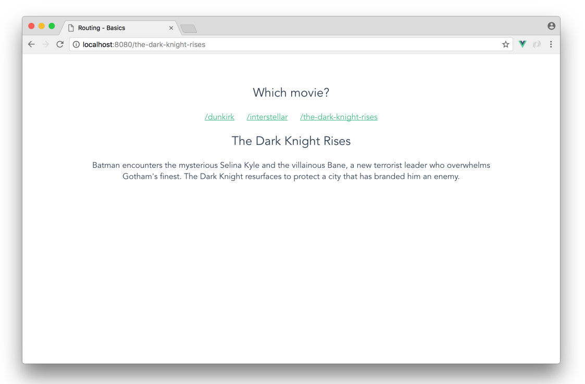
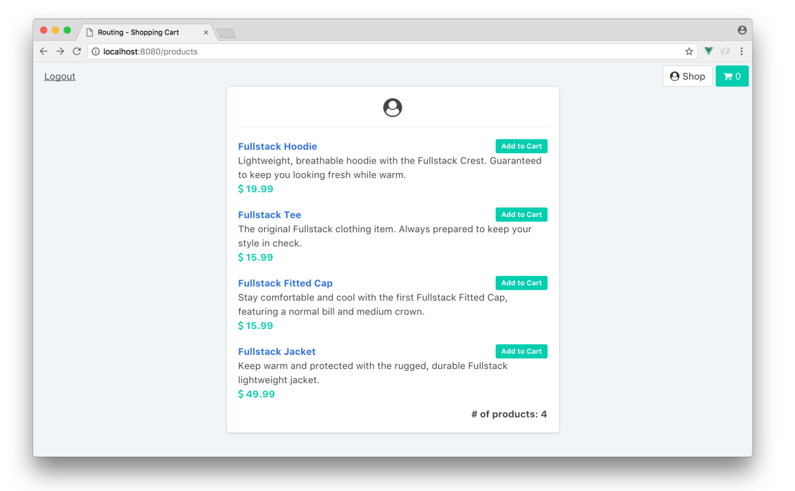

### This chapter main include two demo: basics and shopping_cart.
The basic is a simple demo to explain route in original js.The result as below:

### We learn vue-route component by this one
The shopping_cart is a plus version. We have write the v1 - in vuex.  
The final result as below:
